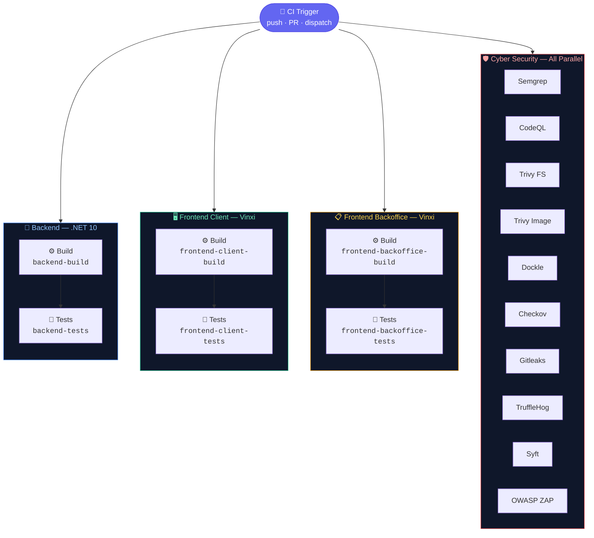
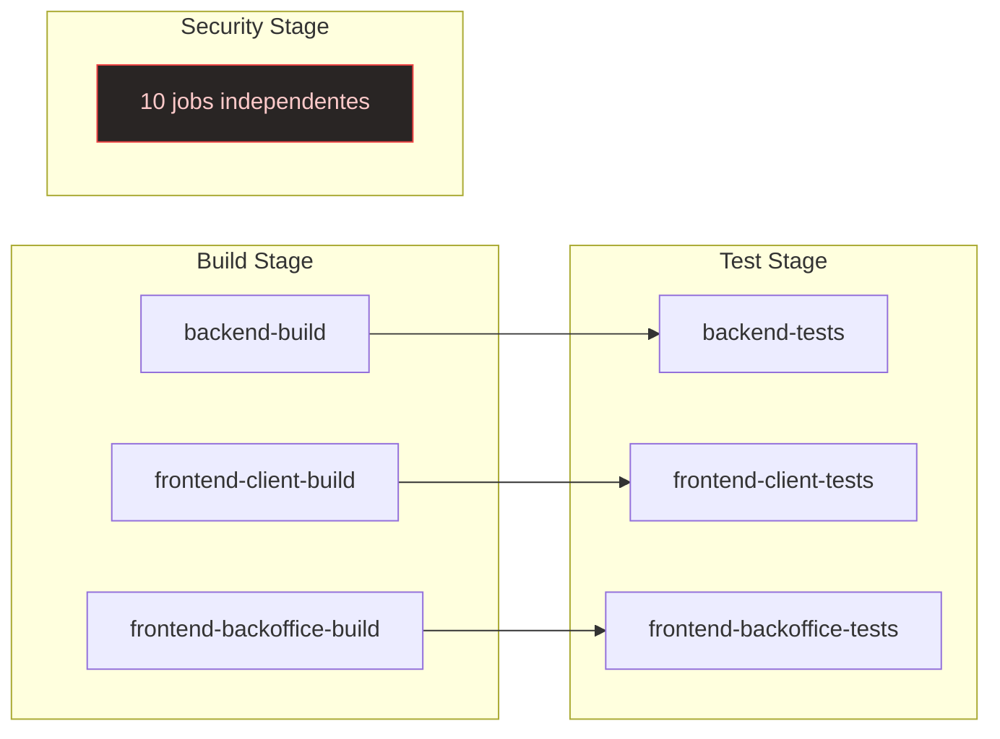

# CI Pipeline — Multi-Stage Architecture

## Visão Geral do Fluxo



---

## Dependências entre Jobs



---

## Pipeline Completa — 16 Jobs em 3 Estágios

```
Stage 1: BUILD (3 jobs paralelos)
├── Backend › Build              → .NET 10 Release, NuGet cache
├── Frontend Client › Build      → Vinxi production, npm cache
└── Frontend Backoffice › Build  → Vinxi production, npm cache
         │ (needs)
Stage 2: TESTS (3 jobs paralelos)
├── Backend › Tests              → Domain (93) + API + Integration + coverage ≥ 80%
├── Frontend Client › Tests      → tsc --noEmit + eslint
└── Frontend Backoffice › Tests  → tsc --noEmit + eslint

Stage 3: SECURITY (10 jobs paralelos, SEM needs)
├── Security › SAST — Semgrep
├── Security › SAST — CodeQL
├── Security › SCA — Trivy
├── Security › Container — Trivy Image
├── Security › Container — Dockle
├── Security › IaC — Checkov
├── Security › Secrets — Gitleaks
├── Security › Secrets — TruffleHog
├── Security › SBOM — Syft
└── Security › DAST — OWASP ZAP
```

---

## Stage 1: Build

| Job | `needs` | O que faz | Por quê |
|-----|---------|-----------|---------|
| **Backend › Build** | — | `dotnet restore` + `dotnet build --configuration Release` | Valida compilação do solution inteira (4 projetos + 3 testes). Cache NuGet acelera ~90%. |
| **Frontend Client › Build** | — | `npm ci` + `npm run build` | Valida build Vinxi production do frontend do cliente. |
| **Frontend Backoffice › Build** | — | `npm ci` + `npm run build` | Valida build Vinxi production do backoffice admin. |

**Se falhar:** Stage 2 (Tests) **nem inicia** — fail-fast, economiza minutos de CI.

---

## Stage 2: Tests

| Job | `needs` | O que faz | Por quê |
|-----|---------|-----------|---------|
| **Backend › Tests** | `backend-build` | 3 suites de teste + merge coverage + threshold 80% | Domain Tests (93 testes), API Tests (WebApplicationFactory), Integration Tests (Testcontainers). Cobertura combinada obrigatória ≥ 80%. |
| **Frontend Client › Tests** | `frontend-client-build` | `tsc --noEmit` + `eslint --max-warnings 0` | Garante tipagem TypeScript correta e qualidade de código consistente. |
| **Frontend Backoffice › Tests** | `frontend-backoffice-build` | `tsc --noEmit` + `eslint --max-warnings 0` | Mesma garantia de qualidade para o backoffice admin. |

---

## Stage 3: Cyber Security — Detalhamento Completo

Os 10 jobs de segurança rodam **em paralelo** desde o início do CI, sem depender de build ou testes. Cada um cobre uma **camada diferente** da stack de segurança.

---

### 📊 Visão Consolidada

| Camada | Ferramenta | O que detecta | O que gera | Falha em |
|--------|-----------|--------------|------------|----------|
| **SAST** | Semgrep | Padrões inseguros no código-fonte (localStorage tokens, CSRF, hardcoded credentials, insecure deserialization, raw CPF comparison) | SARIF → GitHub Security Tab | Regras ERROR |
| **SAST** | CodeQL | Vulnerabilidades profundas via dataflow analysis (SQL injection, XSS, path traversal, insecure deserialization em C# e JS/TS) | SARIF → GitHub Security Tab | HIGH/CRITICAL findings |
| **SCA** | Trivy FS | CVEs conhecidos em dependências (NuGet + npm) com severidade CRITICAL/HIGH | SARIF → GitHub Security Tab | CVEs CRITICAL/HIGH |
| **Container** | Trivy Image | CVEs na imagem Docker final (OS packages, libraries) | SARIF → GitHub Security Tab | CVEs CRITICAL/HIGH |
| **Container** | Dockle | Más práticas de construção Docker (root user, ADD vs COPY, sem HEALTHCHECK, secrets em ENV) | CLI report | FATAL/ERROR |
| **IaC** | Checkov | Misconfigurations no Docker Compose (privileged, volumes host, secrets em ENV) | SARIF → GitHub Security Tab | Checks HIGH |
| **Secrets** | Gitleaks | Padrões de credenciais commitadas (API keys, JWT secrets, connection strings) | GitHub Issues + report | Padrões detectados |
| **Secrets** | TruffleHog | Credenciais **verificadas como ativas** via autenticação real | SARIF → GitHub Security Tab | Credenciais ativas |
| **SBOM** | Syft | Inventário completo de dependências (SPDX source + CycloneDX image) | Artifacts (30 dias) + GitHub Dependency Graph | Nunca falha |
| **DAST** | OWASP ZAP | Vulnerabilidades em runtime (headers, CORS, XSS, CSRF, misconfigurations) | Artifacts (JSON + HTML) | Nunca falha (baseline) |

---

### 1️⃣ Security › SAST — Semgrep

**O que é:** Static Application Security Testing — scanner de padrões inseguros no código-fonte.

**Por que Semgrep e não só CodeQL:**

| Aspecto | Semgrep | CodeQL |
|---------|---------|--------|
| Velocidade | ~30s | ~2min |
| Foco | Padrões superficiais conhecidos | Dataflow analysis profundo |
| Customização | Regras YAML simples | QueriesQL complexas |
| Tempo de feedback | Imediato em PRs | Demora mais, mas encontra mais |

**São complementares, não redundantes.** Semgrep pega o óbvio rápido; CodeQL encontra o sutil depois.

**Regras custom do projeto (6):**

| Regra | Linguagem | Severidade | O que detecta |
|-------|-----------|-----------|--------------|
| `no-localstorage-tokens` | TypeScript/JS | ERROR | `localStorage.setItem` com tokens/chaves de auth |
| `no-dangerously-set-inner-html` | TypeScript/JS | ERROR | `dangerouslySetInnerHTML` sem sanitização (XSS) |
| `no-hardcoded-credentials` | C# | ERROR | Connection strings com password, API keys hardcoded |
| `no-missing-csrf` | C# | ERROR | `[HttpPost]`/`[HttpPut]`/`[HttpDelete]` sem `[ValidateAntiForgeryToken]` |
| `no-raw-cpf-cnpj-comparison` | C# | WARNING | Comparação de strings CPF/CNPJ em vez de validação via value object |
| `no-insecure-deserialization` | C# | ERROR | `BinaryFormatter`, `TypeNameHandling.Auto/All` (RCE risk) |

**Resultado gerado:**

- `semgrep.sarif` → upload para GitHub Security Tab via `github/codeql-action/upload-sarif@v4`
- Categoria: `semgrep` (separada no dashboard)
- Falha o job se encontrar regras com severidade ERROR

**Onde ver resultados:** GitHub → Security → Code scanning alerts → filter by `semgrep`

---

### 2️⃣ Security › SAST — CodeQL

**O que é:** Motor de análise semântica da GitHub. Constrói um grafo do código e executa queries de vulnerabilidade via **dataflow analysis**.

**Por que CodeQL:**

- É a ferramenta SAST mais profunda disponível gratuitamente no GitHub
- Detecta vulnerabilidades que análise de padrão (Semgrep) não encontra: **fluxo de dados real** (ex: input do usuário → query SQL sem sanitização)
- Mantido pelo GitHub Security Lab, com queries atualizadas continuamente
- **Obrigatório** para qualquer pipeline de segurança séria — é o "padrão ouro" do SAST

**Linguagens analisadas:**

| Linguagem | Queries aplicadas |
|-----------|-----------------|
| **C#** | SQL Injection, XSS, path traversal, insecure deserialization, command injection, weak cryptography |
| **JavaScript/TypeScript** | XSS, prototype pollution, command injection, eval usage, unsafe DOM manipulation |

**Resultado gerado:**

- SARIF automático (CodeQL gera e faz upload nativamente)
- Categoria: `codeql`
- Encontrado no GitHub Security Tab → Code scanning alerts
- Falha o job se encontrar vulnerabilidades HIGH/CRITICAL

**Onde ver resultados:** GitHub → Security → Code scanning alerts → filter by `codeql`

---

### 3️⃣ Security › SCA — Trivy (Filesystem)

**O que é:** Software Composition Analysis — escaneia dependências (NuGet, npm, etc.) em busca de CVEs conhecidos.

**Por que Trivy e não só Dependabot:**

| Aspecto | Dependabot | Trivy |
|---------|-----------|-------|
| Função | Abre PRs automáticos com updates | **Bloqueia** merge com CVEs críticos |
| Timing | Semanal (schedule) | Cada PR (gate) |
| Fail behavior | Não bloqueia | **Bloqueia** (exit code 1) |
| Scope | Updates disponíveis | CVEs exploráveis agora |

**Dependabot atualiza, Trivy protege.** São complementares.

**Configuração do projeto:**

- Severidade filter: `CRITICAL,HIGH` apenas
- `ignore-unfixed: true` — ignora CVEs sem patch disponível (não adianta bloquear se não há solução)
- Arquivo `.trivyignore` para documentar exceções aceitáveis com justificativa

**Resultado gerado:**

- `trivy-results.sarif` → upload para GitHub Security Tab
- Categoria: `trivy`
- Falha o job se detectar CVEs CRITICAL ou HIGH com fix disponível

**Onde ver resultados:** GitHub → Security → Code scanning alerts → filter by `trivy`

---

### 4️⃣ Security › Container — Trivy Image Scan

**O que é:** Escaneia a **imagem Docker final** (não o código-fonte) em busca de vulnerabilidades no OS, bibliotecas nativas e packages do sistema.

**Por que Trivy Image e não só Trivy FS:**

| Aspecto | Trivy FS (job #3) | Trivy Image (este job) |
|---------|---------|------|
| O que escaneia | Arquivos do repositório (package.json, .csproj) | Imagem Docker construída (alpine packages, .NET runtime) |
| O que encontra | CVEs em dependências de código | CVEs em packages do SO (libc, openssl, libcurl, etc.) |
| Exemplo | CVE em pacote npm desatualizado | CVE em `libssl1.1` do Alpine Linux |

**Camadas completamente diferentes.** Uma imagem Docker tem centenas de packages do SO que o SCA de código não vê.

**Resultado gerado:**

- `trivy-image-results.sarif` → upload para GitHub Security Tab
- Categoria: `trivy-image` (separada do Trivy FS)
- Falha o job se detectar CVEs CRITICAL ou HIGH na imagem

**Onde ver resultados:** GitHub → Security → Code scanning alerts → filter by `trivy-image`

---

### 5️⃣ Security › Container — Dockle

**O que é:** Container Linter — verifica **boas práticas de segurança** na construção de imagens Docker (CIS Docker Benchmarks).

**Por que Dockle e não só Trivy Image:**

| Aspecto | Trivy Image | Dockle |
|---------|-----------|--------|
| Foco | CVEs em packages (vulnerabilidades conhecidas) | **Más práticas de construção** (configuração) |
| Exemplo | CVE no openssl | Container rodando como root, uso de `ADD` ao invés de `COPY`, secrets em variáveis de ambiente, falta de HEALTHCHECK |

**Dockle não procura bugs no código ou CVEs — procura erros de engenharia na imagem.**

**Checks que Dockle executa:**

| Check | O que verifica | Impacto |
|-------|--------------|---------|
| `DKL-DI-0001` | Não usar `latest` tag | Reprodutibilidade do build |
| `DKL-DI-0002` | Não usar `ADD` desnecessariamente | `ADD` tem comportamento inesperado (auto-extract, URL download) |
| `DKL-DI-0005` | Não rodar como root | Privilégios mínimos (se container comprometido, dano limitado) |
| `DKL-DI-0006` | Não colocar secrets em ENV vars | ENV vars são visíveis via `docker inspect` |
| `DKL-LI-0001` | Ter HEALTHCHECK definido | Orquestradores precisam detectar containers doentes |
| `DKL-DI-0004` | Usar `.dockerignore` | Build context limpo, sem arquivos sensíveis |

**Resultado gerado:**

- CLI report no log do job
- Falha o job em checks FATAL ou ERROR
- Não gera SARIF (Dockle não suporta o formato)

---

### 6️⃣ Security › IaC — Checkov

**O que é:** Infrastructure as Code scanner — verifica configurações de infraestrutura (Docker Compose, Terraform, Kubernetes, CloudFormation) contra políticas de segurança.

**Por que Checkov neste projeto:**

- `compose.yaml` é IaC — define containers, volumes, networks, secrets, portas expostas
- Checkov encontra: `privileged: true`, volumes host montados, secrets em variáveis de ambiente, portas expostas em `0.0.0.0`, falta de healthcheck, uso de imagem `latest`
- **Desloca segurança de infra para "shift-left"** — encontra problemas antes do deploy, não depois

**Checks aplicados neste projeto:**

| Check | O que verifica | Status no projeto |
|-------|--------------|------------------|
| `CKV_DOCKER_2` | Container não deve rodar como privileged | ✅ Pass |
| `CKV_DOCKER_3` | Container não deve montar volumes host sensíveis | ✅ Pass |
| `CKV_DOCKER_7` | Não expor portas em `0.0.0.0` | ✅ Pass (usando `127.0.0.1`) |
| `CKV_DOCKER_8` | Usar imagens com tag fixa (não latest) | ✅ Pass |

**Resultado gerado:**

- `checkov-results.sarif` → upload para GitHub Security Tab
- Categoria: `checkov`
- Falha o job em checks HIGH

**Onde ver resultados:** GitHub → Security → Code scanning alerts → filter by `checkov`

---

### 7️⃣ Security › Secrets — Gitleaks

**O que é:** Scanner de credenciais no histórico Git — detecta padrões de secrets commitadas (API keys, tokens, connection strings, chaves privadas).

**Por que Gitleaks:**

- Desenvolvedores cometem o erro de commitar `.env`, connection strings, chaves JWT
- Uma vez no Git, o secret **permanece no histórico** mesmo se o commit for revertido
- Gitleaks escaneia **todo o histórico** do repositório, não só o diff atual

**Patterns que detecta neste projeto:**

| Pattern | Exemplo | Risco |
|---------|---------|-------|
| AWS/Azure/GCP keys | `AKIA...EXAMPLE` | Acesso à cloud |
| JWT signing keys | chaves de assinatura fracas | Forge de tokens |
| DB connection strings | strings de conexão com senha | Acesso ao banco |
| Keycloak secrets | Client secrets do admin API | Acesso ao Keycloak |
| Generic API keys | `sk-*`, `ghp_*`, `xoxb-*` | Acesso a APIs externas |

**Configuração:**

- `.gitleaks.toml` com regras customizadas para o stack do projeto
- `fetch-depth: 0` para escanear histórico completo
- Executa em PRs e em push para main

**Resultado gerado:**

- `gitleaks-report.json` → artifact do workflow
- Abre GitHub Issue com os findings
- Falha o job se detectar qualquer secret

**Onde ver resultados:** GitHub → Security → Secret scanning alerts

---

### 8️⃣ Security › Secrets — TruffleHog

**O que é:** Scanner de credenciais com **verificação ativa** — tenta autenticar com cada secret encontrado para confirmar que está ativa.

**Por que TruffleHog e não só Gitleaks:**

| Aspecto | Gitleaks | TruffleHog |
|---------|---------|-----------|
| Detecção | Pattern matching (regex) | Pattern matching + **verificação HTTP** |
| False positives | Alto (encontra secrets expiradas/de teste) | **Baixo** (só reporta se a autenticação funcionar) |
| Velocidade | Rápido (~30s) | Mais lento (~2-3min, faz HTTP requests) |

**Gitleaks encontra, TruffleHog confirma.** Juntos, eliminam alarmes falsos.

**Configuração:**

- `--only-verified` flag — só reporta credenciais que autenticaram com sucesso
- `fetch-depth: 0` para escanear histórico completo
- SARIF gerado localmente para upload

**Resultado gerado:**

- `results.sarif` → upload para GitHub Security Tab
- Categoria: `trufflehog`
- Falha o job se encontrar credenciais ativas verificadas

**Onde ver resultados:** GitHub → Security → Code scanning alerts → filter by `trufflehog`

---

### 9️⃣ Security › SBOM — Syft

**O que é:** Gerador de Software Bill of Materials (SBOM) — inventário completo de todas as dependências do projeto.

**Por que Syft / SBOM:**

- **Compliance:** SBOM é requisito do Executive Order 14028 (EUA), NIST SSDF, e indiretamente relevante para LGPD
- **Rastreabilidade:** Quando um novo CVE é publicado (ex: Log4Shell), você precisa saber **se e onde** usa aquela dependência. SBOM responde isso em segundos
- **Supply chain security:** Se um pacote npm for comprometido, o SBOM mostra exatamente quais builds foram afetadas
- **GitHub Dependency Graph:** O Syft alimenta o Dependency Graph do GitHub, que por sua vez alimenta o Dependabot com dados mais ricos

**Dois SBOMs gerados:**

| SBOM | Formato | O que contém |
|------|---------|-------------|
| Source code | SPDX-JSON | Todas as dependências do repositório (NuGet + npm packages) |
| Backend image | CycloneDX-JSON | Dependências da imagem Docker final (incluindo OS packages) |

**Resultado gerado:**

- `sbom-source.spdx.json` + `sbom-image.cyclonedx.json` → artifacts do workflow (30 dias)
- `dependency-snapshot: true` → alimenta GitHub Dependency Graph
- **Nunca falha** — é informativo, não blocking

**Onde ver resultados:** GitHub → Security → Dependency graph

---

### 🔟 Security › DAST — OWASP ZAP Baseline

**O que é:** Dynamic Application Security Testing — escaneia a aplicação **rodando** em busca de vulnerabilidades em tempo de execução.

**Por que OWASP ZAP e não só SAST:**

| Aspecto | SAST (Semgrep/CodeQL) | DAST (ZAP) |
|---------|------|------|
| Quando analisa | Código-fonte (estático) | Aplicação rodando (dinâmico) |
| O que encontra | Bugs no código | Vulnerabilidades em runtime |
| Exemplos | SQL injection no source | Headers de segurança faltando, XSS via resposta HTTP, CSRF, CORS misconfiguration |

**SAST olha o código, DAST olha o comportamento.** São camadas diferentes de análise.

**Configuração do projeto:**

- **Baseline scan** (não full scan) — rápido, focado em issues óbvias
- `fail_action: false` — informativo, **não bloqueia merges** (pode ser habilitado no futuro quando tuning amadurecer)
- Roda contra API em background com PostgreSQL service container
- `.zap-rules.tsv` — arquivo de exclusão para falsos positivos documentados

**O que o baseline scan verifica:**

| Categoria | Exemplos |
|-----------|---------|
| Headers de segurança | `X-Frame-Options`, `X-Content-Type-Options`, `Content-Security-Policy`, `Strict-Transport-Security` |
| Cookie security | `Secure` flag, `HttpOnly` flag, `SameSite` attribute |
| Information disclosure | Error pages com stack traces, server version headers |
| XSS | Reflected XSS via query parameters |
| CSRF | Missing CSRF tokens em formulários |
| CORS | Wildcard `Access-Control-Allow-Origin` |

**Resultado gerado:**

- `zap_report.json`, `report_json.json`, `report_html.html` → artifacts do workflow (30 dias)
- GitHub Issue automática com resumo dos findings (se houver)
- **Não falha** (baseline informativo)

**Onde ver resultados:** GitHub → Actions → DAST job → Artifacts (download HTML report)

---

## Timeline de Execução

```
Tempo →
Backend Build      ████████ 60s
Backend Tests                 ████████████████ 120s
Client Build       ███████ 45s
Client Tests                 ████ 30s
Backoffice Build   ███████ 45s
Backoffice Tests             ████ 30s
Semgrep            █████████ 90s
CodeQL             ██████████████████ 150s
Trivy FS           ██████ 60s
Trivy Image        █████████████ 120s
Dockle             █████████████ 120s
Checkov            █████ 45s
Gitleaks           ███ 30s
TruffleHog         ███ 30s
Syft SBOM          █████████ 90s
OWASP ZAP          ██████████████████████ 180s
```

**Tempo total estimado:** ~3-5 min (paralelismo máximo). Stage mais lento determina o tempo total.

---

## Benefícios do Multi-Stage

| Benefício | Descrição |
|-----------|-----------|
| ⚡ **Fail-fast** | Build falha → testes nem iniciam |
| 🔄 **Re-run seletivo** | Re-executar só testes sem refazer build |
| 📊 **Visibilidade** | Cada stage aparece separado na UI do GitHub |
| 🚀 **Paralelismo** | 4 grupos rodam simultaneamente |
| 🧩 **Isolamento** | Falha em security não bloqueia build/tests e vice-versa |

---

## Naming Convention

Todos os jobs seguem `"Grupo › Stage — Ferramenta"` para fácil identificação na UI:

| Prefixo | Exemplo |
|---------|---------|
| `Backend ›` | `Backend › Build`, `Backend › Tests` |
| `Frontend Client ›` | `Frontend Client › Build`, `Frontend Client › Tests` |
| `Frontend Backoffice ›` | `Frontend Backoffice › Build`, `Frontend Backoffice › Tests` |
| `Security ›` | `Security › SAST — Semgrep`, `Security › DAST — OWASP ZAP` |
